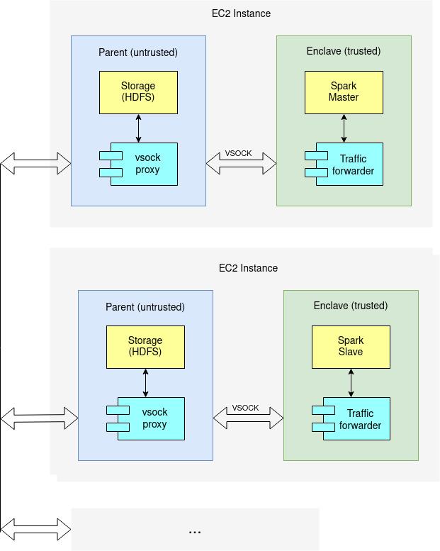
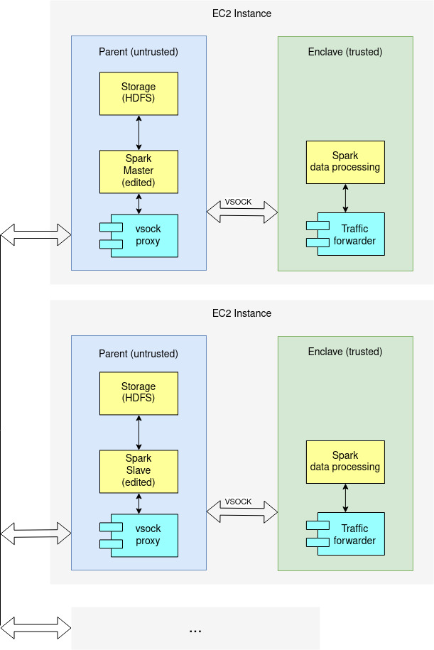

# AWS NitroEnclaves Networking

Due to the isolated environment of the enclave, the only channel of communication between applications that are running on the instance and applications that are running in the enclave is the `vsock` socket.

## Possible designs

Current designs do not include encryption step.

### Design 1: Deploy Spark master and workers as a whole in Enclave

This design proposes packaging Spark master/workers into a docker images without any changes to either the master or the worker. These docker images are then converted to NitroEnclaves and deployed, one image per EC2 node.

Communication between enclave and parent is established by introducing a `traffic-forwarder` in the enclave and a `vsock-proxy` in the parent. The `traffic-forwarder` will use the `vsock` interface to forward all Spark traffic to the parent component. The `vsock-proxy` will listen for incoming traffic and direct it to the appropriate endpoints, such as to storage, Spark master, Spark worker. Therefore, in this design, requests are initiated from within the enclaves.

Storage, e.g., HDFS, is deployed entirely in the parent component with no changes. The expectation is that any sensitive data leaving the enclave premise is appropriately encrypted.

#### Pros & cons

++ Easy to implement and maintain: switching to another Spark version requires deploying a new docker images  
-- Large TCB

### Design 2: Deploy security critical components of Spark in Enclave

This design proposes splitting Spark into two parts, a non-security sensitive part that does not require access to sensitive data and a security sensitive part that processes sensitive data. The non-sensitive part is deployed in the parent component of the NitroEnclave instance, and the sensitive part is deployed in the enclave.

Whenever data processing needs to be performed, the non-sensitive part of spark calls into the enclave via `vsock` and waits to receive the process results back.

As with the previous design, storage is deployed entirely in the parent component.

#### Pros & cons

++ Small TCB  
-- Harder to implement and maintain: requires extracting security critical path into a separate application  

---

## Resources

## Guides
- https://docs.aws.amazon.com/enclaves/latest/user/developing-applications-linux.html
- https://nitro-enclaves.workshop.aws/en/my-first-enclave/secure-local-channel.html
- https://www.linkedin.com/pulse/aws-nitro-enclaves-bruno-pairault/

## Example applications

- https://levelup.gitconnected.com/running-python-app-on-aws-nitro-enclaves-56024667b684
- https://towardsdatascience.com/privacy-preserving-deep-learning-with-aws-nitro-enclaves-74c72a17f857
- https://github.com/fortanix/rust-sgx/search?q=vsock
